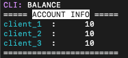

# LaChain

A distributed system based on Lamport's mutual exclusion algorithm that uses blockchains as the process queue.

## System Specification

The system specifications can be changed vis the `config.py` file.

The system consists a `bank server` and `clients`, both of which can be receive commands from the `CLI`.

The following table details each config variable. These can be changed to modify the system as wished.
| Variable  | Description |
|-----------|-------------|
| `BANK_PORT` | Port for the bank's listening socket. |
| `CLIENT_PORTS` | Ports for the respective client's listening sockets. Add/remove clients here with a port number to set number of clients. |
| `BUFF_SIZE` | Max size of the buffer read by the `recv()` of a socket. |
| `HOST` | Host IP address. Localhost for local execution. |
| `INIT_BALANCE` | The initial balance with which every client starts. |
| `DEF_DELAY` | The delay before messages are sent among clients to simulate time taken for message passing |

The clients can make 2 kinds of transactions:
1. Balance: Get the balance of self from the server
2. Transfer: Transfer a certain amount from self to another client

Only the `Transfer` transaction requires a mutex lock to be acquired on the server by a client.

## Running the system

If you do not have applescript for python installed, run on terminal:
```sh
pip3 install applescript
```

Clone the repository and navigate to the repository root.

Startup the system by running:
```sh
python3 lachain.py
```

This terminal instance will function as the CLI for the system.


## LaChain CLI

### Server

View the balance table on the server terminal:
```sh
>>> balance server
```

The server terminal prints the balance sheet as.



### Clients

The valid client names are:
```
client_1
client_2
client_3
```

#### View the balance of a client
```sh
>>> balance client <client_name>

example:
>>> balance client client_1
```

The client fetches and prints the balance as such.


#### View the blockchain of a client
```sh
>>> bchain <client_name>

example:
>>> bchain client_1
```

The client's terminal prints out the blockchain as such.


#### Issue a transfer transaction to a client:
```sh
>>> transfer <from_client_name> <to_client_name> <amount>

example:
>>> transfer client_1 client_2 5
```

The client tries to get a mutex lock in coordination with other clients and executes the transaction when it achieves the lock.
The transaction will be a success iff the requested transfer amount is less than or equal to the balance of the client.

From L-R: Terminal output for a successful transaction from a client; terminal output for a client receiving the mutex request; terminal output for a failed transaction


## Simulations

The `simulation.txt` file can be modified to run simulations on the system.

The file contains a default simulation showing 4 basic scenarios.

To run the simulation, run in the CLI:
```
>>> simulate
```

### Commands
The simulation file can have the commands detailed in [LaChain CLI](#lachain-cli) and 3 othe commands: `delay`, `wait` and `#`.

The `delay` commands pauses the simulation for the specified number of seconds. The value can be an integer or fraction.
```
delay <duration>

example:
delay 2
delay 0.5
```

The `wait` command pauses execution and waits for user input `ENTER` to resume. This command does not take any parameters.
```
wait
```

The `#` command can be used for verbose output in the CLI while running the simulation. The lise starting with `#` will not be executed, but will be printed in a color.
```
# Simulation 2 : foo bar
```

A simulation run on the CLI would look something like:


### Default Simulation
The simulatio nfile in this repo simulates 4 basic scenarios:
1. A single transfer transaction, with transaction amount less than the balance (success)
2. 2 concurrent transfer transactions
3. 3 concurrent transfer transactions
4. A single transfer transaction, with transaction amount greater than the balance (abort)

The execution events for `1` and `4` are similar, so only `1` has been detailed here. Every next scenario continues from the state in which the previous scenario ended.

#### 1. Trivial single transaction (success)
A single transfer transaction is issued by `client_1`. The client gets a mutex and executes the transaction.


#### 2. Two concurrent transactions
As per Lamport's totalally ordered clock, the transaction issued by `client_2` has a higher priority over the transaction issued by `client_3`. We issue the transaction from `client_3` first and after a slight delay, from `client_2`.

The `client_2` achieves a mutex lock and executes the transaction first, and then `client_3` executes its transaction.


#### 3. Three concurrent transactions
The transactions issued by the 3 clients have their priority in the order `client_2` > `client_3` > `client_1`.

We issue the transactions in the reverse order, with slight delays between them. Still, the order of execution follows the order of priority.

